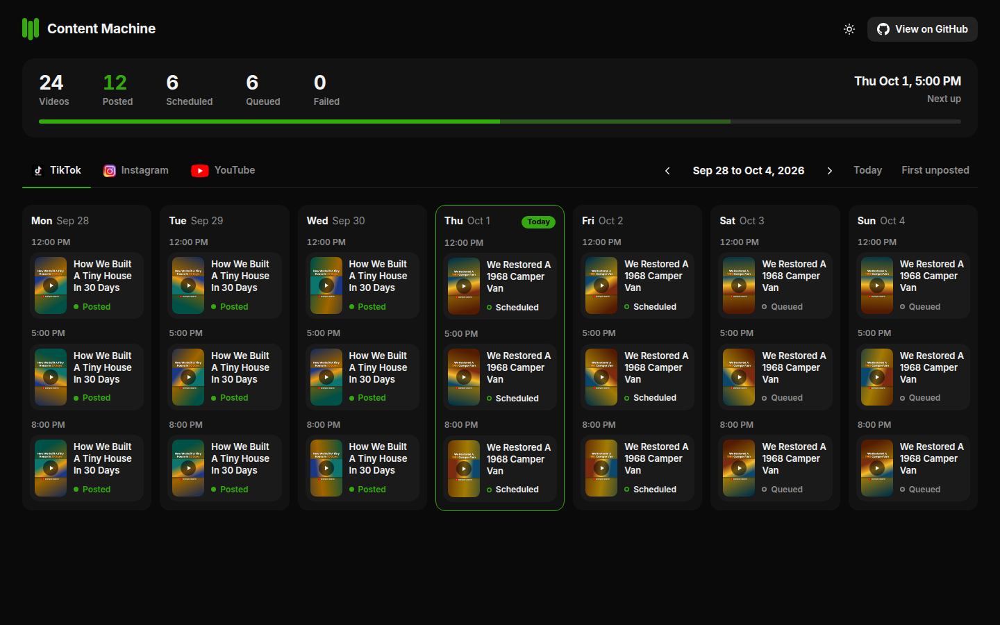
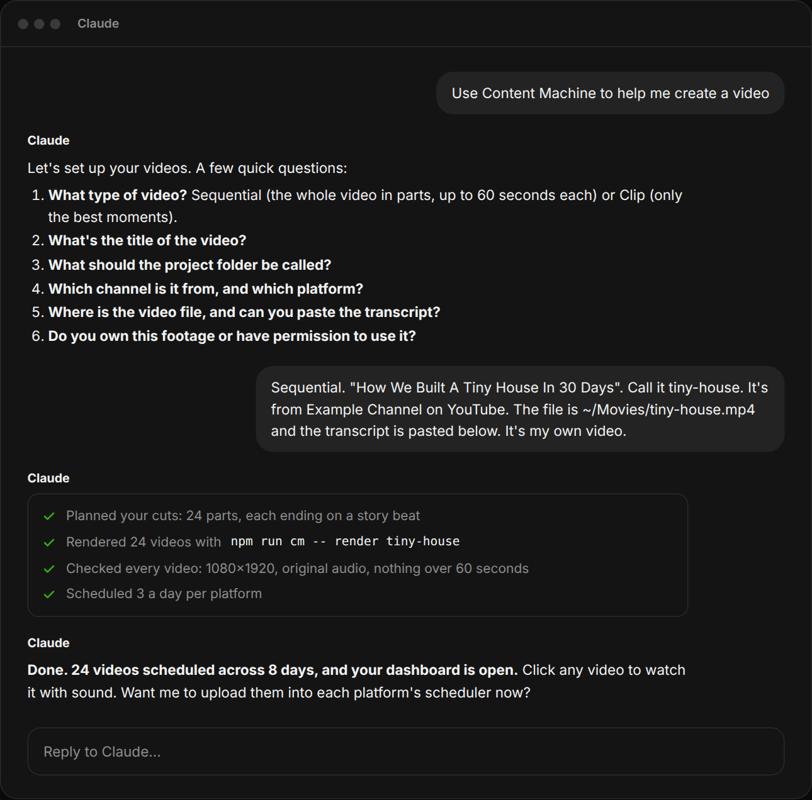
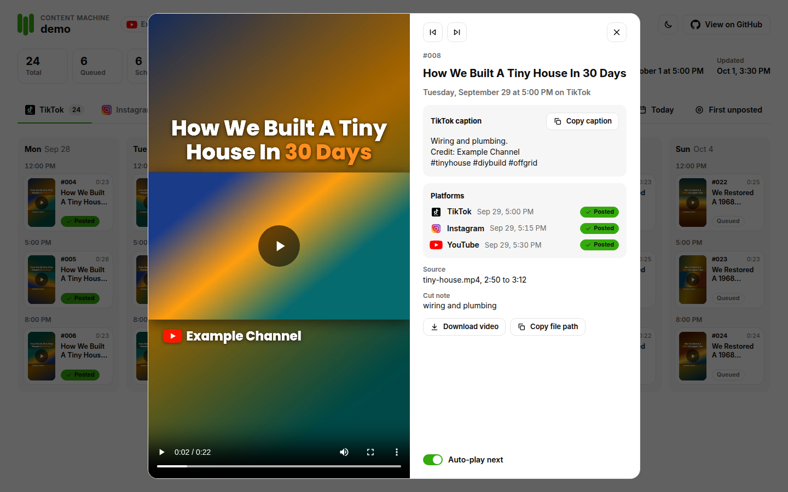
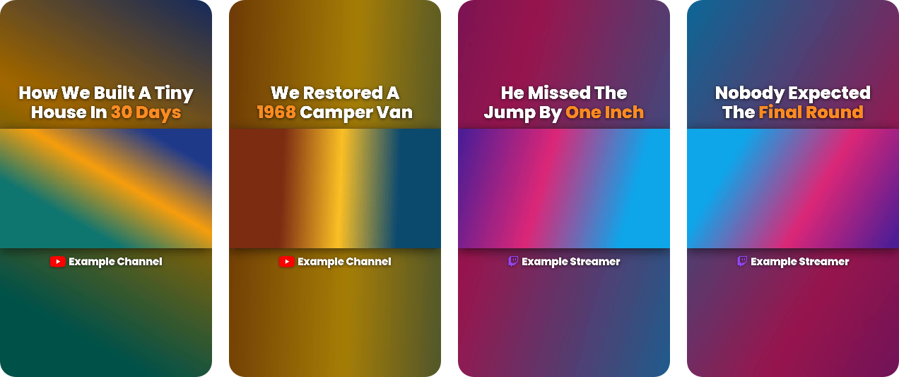
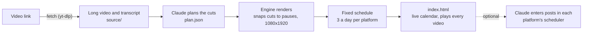
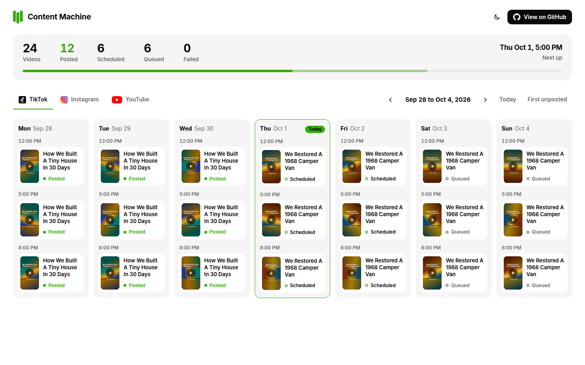
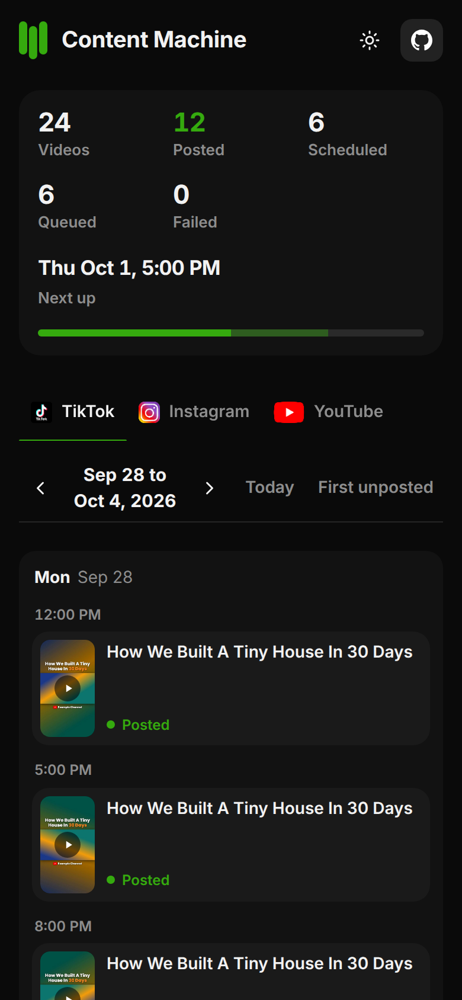

<p align="center">
  
</p>

<h1 align="center">Content Machine</h1>

<p align="center">
  Turn one long video into a steady, scheduled stream of short vertical videos for TikTok, Instagram Reels and YouTube Shorts, driven by Claude.
</p>

<p align="center">
  <a href="LICENSE"></a>
  
  
</p>

## Results

<p align="center">
  
</p>

<table>
  <tr>
    <td width="50%"></td>
    <td width="50%"></td>
  </tr>
</table>

<p align="center">
  
  <br><sub>Finished videos: the same layout every time. The dashboard and videos above come from the built-in demo, which uses synthetic footage.</sub>
</p>


## What it is

You give Claude a link to a long video you have the rights to (or the file and its transcript). Claude downloads it with its captions, reads the transcript and decides where to cut. A local engine renders the cuts as 1080x1920 videos with the same layout every time, gives each one a fixed posting slot (three a day per platform) and fills in a live dashboard where you can watch every video with sound. When you are ready, Claude can enter the videos into each platform's own scheduler through your logged-in browser.

Two modes, one plan format:

|                | Sequential                                                 | Clip                                                     |
| -------------- | ---------------------------------------------------------- | -------------------------------------------------------- |
| What it posts  | The whole video, start to finish, in parts                 | Only the best moments                                    |
| Length         | Up to 60 seconds per part, cut at story beats              | 8 to 59 seconds per clip                                 |
| On-video title | The video's title, identical on every part                 | A fresh title for each clip that says what happened      |
| Editing        | None. Original audio, the layout, the title and the credit | Same: just the cut, the layout, the title and the credit |

## How it works



## Quick start

**You need:** [Claude Code](https://claude.com/claude-code). Claude installs the rest (Node 20 or newer, ffmpeg and yt-dlp) during setup. Optional: the Claude in Chrome extension, for hands-off uploading.

```bash
git clone https://github.com/edison16a/Content-Machine.git
cd Content-Machine
```

Open Claude Code in that folder and say:

```text
Set up Content Machine
```

Claude follows [`playbook/setup.md`](playbook/setup.md): it installs the tools, builds everything, asks your time zone and opens your dashboard. Then give it a video:

```text
Use Content Machine: https://www.youtube.com/watch?v=...
```

**Your dashboard is [`index.html`](index.html)**, right next to this README. Open it once and leave it open: it updates itself as videos are made, scheduled and posted.

Starting somewhere else? Give Claude the link and it clones the repository itself, following [`playbook/run.md`](playbook/run.md):

```text
Using Content Machine: https://github.com/edison16a/Content-Machine
```

Want to see it before using your own footage? Build the demo (synthetic video, about ten minutes) and open it:

```bash
npm run demo
npm run cm -- open
```

Done with it? `npm run cm -- demo --remove` deletes the demo projects and frees the posting slots they held.

## How it looks in Claude

The conversation from the screenshot at the top, as text:

> **You:** Use Content Machine to help me create a video
>
> **Claude:** Let's set up your videos. A few quick questions:
>
> 1. What type of video? Sequential (the whole video in parts, up to 60 seconds each) or Clip (only the best moments).
> 2. What's the title of the video?
> 3. What should the project folder be called?
> 4. Which channel is it from, and which platform?
> 5. Where is the video file, and can you paste the transcript?
> 6. Do you own this footage or have permission to use it?
>
> **You:** Sequential. "How We Built A Tiny House In 30 Days". Call it tiny-house. It's from Example Channel on YouTube. The file is ~/Movies/tiny-house.mp4 and the transcript is pasted below. It's my own video.
>
> **Claude:** Planned your cuts: 24 parts, each ending on a story beat. Rendered 24 videos. Checked every video: 1080x1920, original audio, nothing over 60 seconds. Scheduled 3 a day per platform.
>
> **Claude:** Done. 24 videos scheduled across 8 days, and your dashboard is open. Click any video to watch it with sound. Want me to upload them into each platform's scheduler now?

## The dashboard

`index.html` at the top of the folder shows every project. It works straight from your disk with no server, plays the real video files, and rereads its data every few seconds, so one open tab is always current. Dark mode is the default; there is a light mode too. Each project also gets a self-contained `dashboard.html` snapshot you can zip and share.

<table>
  <tr>
    <td width="68%"></td>
    <td width="32%"></td>
  </tr>
</table>

- **Post now.** A strip that appears only when a post is due, listing what to post right now.
- **All tab.** The same calendar with every video's status on TikTok, Instagram and YouTube on each card.
- **Statistics.** Total views, estimated income (to six decimals), likes, comments and shares per platform or all together, and a color-coded graph of each over time. Pick which graphs show, search for one video, or read it as a table. Ask Claude to "update my stats" and it reads each platform's analytics for you, or say "activate test data" to see it filled with 30 days of made-up numbers first.
- **Every project on one calendar,** with statistics for all of them. Settings (the gear) can switch to a single project.
- **Play every video with sound.** Click a card and it plays right away. Space, M, F and Esc work as you would expect.
- **Stats at a glance** for the selected platform: posted, scheduled, queued, failed and what posts next.
- **Platform tabs** with the official logos. Each tab shows that platform's times, statuses and caption.
- **Day, week or month calendar** with three timed slots per day, Today, and First unposted. Week is the default.
- **Copy the caption, copy the file path, or open the video's folder** from the player.
- Phone layout, keyboard friendly. Hovering a card plays a silent preview.

## Folder structure

```
projects/<project-name>/
├── dashboard.html      a shareable snapshot (the live view is index.html at the root)
├── project.json
├── README.txt          what each folder is for
├── source/             INPUTS (yours): long videos, <video>.transcript.txt, brief.txt
│   └── downloads/      videos and captions saved from a link by fetch
├── plan/               DECISIONS: plan.json, metadata.json, schedule.json, schedule-history.log, report.md
├── videos/             FINAL: 001.mp4, 002.mp4 and so on (what gets posted)
├── thumbs/             posters for the dashboard
└── work/               DISPOSABLE: caches, QA images, logs
```

**Four kinds of folders, one job each:** inputs, decisions, deliverables and disposable. The tool owns `plan/schedule.json`, `videos/`, `thumbs/` and `work/`. Keep `dashboard.html` next to `videos/` and `thumbs/`, and move the project folder as one unit. More in [docs/folder-structure.md](docs/folder-structure.md).

## Consistency by design

- **Fixed cadence.** Three posts a day per platform at the same times (12:00, 17:00 and 20:00 by default), with Instagram 15 minutes and YouTube 30 minutes after TikTok.
- **Deterministic scheduling.** A pure function decides every date, never a language model. Scheduled items never move, and projects posting to the same accounts never take each other's slots. Daylight saving changes are handled.
- **Overflow queues forward.** Thirty videos fill ten days. There is no limit.
- **Same layout and brand every time.** The same font, title block, credit line and video position, so a feed looks like one series.
- **Cuts land on pauses.** Every cut moves to the nearest pause in the audio, so no video starts or ends mid-word.

## Posting and scheduling realities

As of October 2026. **Verify in your account:** platforms change these often, and this project has not tested them.

| Platform        | Desktop scheduler   | Needs                       | How far ahead                                                    |
| --------------- | ------------------- | --------------------------- | ---------------------------------------------------------------- |
| TikTok          | TikTok Studio       | Business or Creator account | About 10 days                                                    |
| Instagram Reels | Meta Business Suite | Professional account        | Weeks                                                            |
| YouTube Shorts  | YouTube Studio      | Any channel                 | No published limit, but every upload counts toward a daily limit |

When a scheduler refuses a date, Claude stops that platform, leaves the rest queued and tells you when to come back. Details in [docs/platform-scheduling.md](docs/platform-scheduling.md).

## Responsible use

Only use footage you own or have permission to use: your own videos, an official clipping program, or a creator who agreed. Sequential re-posts a whole video, so it needs permission that covers that. Being able to download a link does not mean you may re-post it: `fetch` is for videos you have permission to use. Audio is never changed, titles must be true to the footage, and every video credits its source. Follow each platform's rules. See [docs/responsible-use.md](docs/responsible-use.md).

## The repository

```
packages/core        pure logic: schemas, transcripts, fetch rules, plans, snapping, layout, scheduling, statuses
packages/render      ffmpeg rendering, canvas text overlays, thumbnails, QA
packages/dashboard   the dashboard client, the dashboard.html generator and the live data file
packages/cli         the content-machine command, including yt-dlp downloads
index.html           the live dashboard
playbook/            what Claude reads at runtime
docs/                specs, architecture, ADRs, JSON Schemas
```

Every command: `npm run cm -- <command>`. Run `npm run cm -- --help` for the list (`doctor`, `new`, `fetch`, `stats`, `testdata`, `transcript`, `render`, `preview`, `check`, `schedule`, `mark`, `dashboard`, `open`, `status`, `autoplan`, `demo`, `schema`). Each one takes `--json` for machine-readable output. Read [docs/architecture.md](docs/architecture.md) for how it fits together.

## Development

```bash
npm install          # installs and builds every package
npm run check        # lint, typecheck, build, unit and integration tests
npm run demo         # builds projects/demo from synthetic video
npm run test:e2e     # dashboard browser tests in Google Chrome
npm run docs:images  # regenerates the screenshots in docs/images
```

Supported on macOS and Linux. Windows is untested; WSL may work.

## Contributing

Issues and pull requests are welcome. Start with [CONTRIBUTING.md](CONTRIBUTING.md) and the [Code of Conduct](CODE_OF_CONDUCT.md). Report security problems privately, as described in [SECURITY.md](SECURITY.md).

## Roadmap

- Word-level transcript timing for even tighter cuts.
- Optional burned-in captions, off by default.
- A "season" view in the dashboard for projects that span months.
- Windows support.

## License

[MIT](LICENSE). Third-party fonts, logos and packages are listed in [THIRD_PARTY_NOTICES.md](THIRD_PARTY_NOTICES.md).

Content Machine is an independent open-source project. It is not affiliated with, endorsed by or sponsored by TikTok, ByteDance, Instagram, Meta, YouTube, Google or Anthropic. All trademarks belong to their owners.
