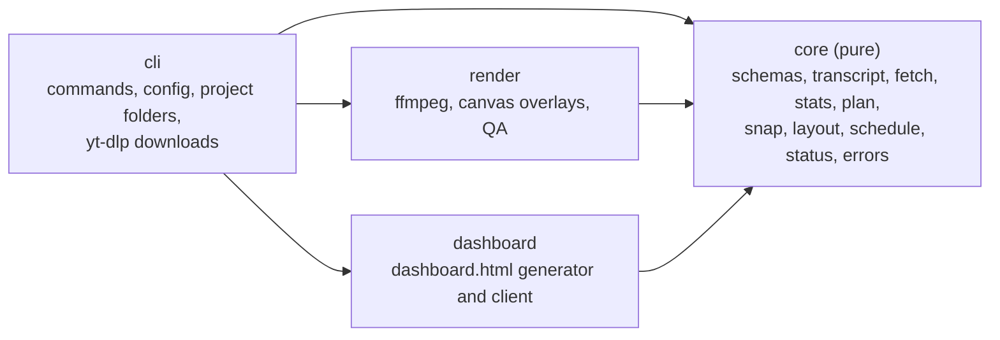

# Architecture

Content Machine is a TypeScript monorepo with four packages. Pure logic sits in the middle; side effects live at the edges.

## Rules

- **Dependencies point one way.** `cli` may use everything; `render` and `dashboard` may only use `core`; `core` uses nothing else. ESLint (`no-restricted-imports`) and `test/architecture.test.ts` both enforce it, and the test also fails on any circular import.
- **`core` is pure.** No `fs`, `child_process`, `os`, network or clock. It takes plain data and a `Clock` and returns plain data. That makes the scheduler, snapper, layout and validators easy to test exhaustively.
- **Side effects sit behind three small interfaces** in `core/src/ports`: `FileSystem` (atomic writes), `ProcessRunner` (argument arrays only, never a shell string) and `Clock`. Real implementations live in `render/src/io`; tests pass fakes or temp folders.
- **Validation at every boundary.** Every JSON file on disk is parsed through a zod schema in `core/src/schemas`. The schemas are the single source of truth for the TypeScript types and for the JSON Schemas in `docs/schemas/`.
- **Typed errors.** Every expected failure is a `ContentMachineError` with a stable code, a fix-it hint and a fixed exit code (2 usage, 3 validation, 4 missing dependency, 5 render or check). Anything else is a bug and exits 1.

## Where does X go?

| You want to change                            | Put it in                                                |
| --------------------------------------------- | -------------------------------------------------------- |
| A JSON file's shape                           | `packages/core/src/schemas`, then `npm run docs:schemas` |
| How transcripts are read                      | `packages/core/src/transcript`                           |
| Which captions and flags yt-dlp gets          | `packages/core/src/fetch`                                |
| Running yt-dlp, saving downloaded captions    | `packages/cli/src/download`                              |
| Plan rules (lengths, gaps, accents)           | `packages/core/src/plan`                                 |
| How cuts move onto pauses, or autoplan        | `packages/core/src/snap`                                 |
| Where things sit on the canvas, line breaking | `packages/core/src/layout`                               |
| Posting dates, slots, statuses                | `packages/core/src/schedule`, `packages/core/src/status` |
| ffmpeg arguments and the filter graph         | `packages/render/src/ffmpeg`                             |
| Title, credit, shadow and logo drawing        | `packages/render/src/overlays`                           |
| The render loop, thumbnails, preview          | `packages/render/src/pipeline`                           |
| Output checks and contact sheets              | `packages/render/src/qa`                                 |
| What the dashboard shows or how it looks      | `packages/dashboard/src/client` (views, lib, styles)     |
| How dashboard.html and the live data are made | `packages/dashboard/src/generate`                        |
| Which projects the live index lists           | `packages/cli/src/project/live-index.ts`                 |
| Matching recorded stats to videos             | `packages/core/src/stats`                                |
| Stats totals, timelines and income            | `packages/dashboard/src/shared/stats.ts`                 |
| The statistics section and its graphs         | `packages/dashboard/src/client/views/stats`              |
| A command or flag                             | `packages/cli/src/commands`                              |
| Project folders, config loading, locks        | `packages/cli/src/project`, `config`, `io`               |
| What Claude does at runtime                   | `playbook/`                                              |

## Data flow

1. `new` scaffolds `projects/<name>/` from `config/defaults.json` and `config/local.json`.
2. `fetch` (optional) downloads a video and its captions from a link into `source/downloads/`.
3. Claude writes `plan/plan.json`. `render` probes sources, validates the plan, detects pauses, snaps cuts, draws overlays, runs ffmpeg once per item, writes thumbnails and `work/render-log.json`.
4. `check` probes every output and writes QA frames and contact sheets.
5. Claude writes `plan/metadata.json`. `schedule` assigns slots (pure), records them in `plan/schedule.json` and `schedule-ledger.json` under a lock, and regenerates `dashboard.html`.
6. `mark` moves statuses through the state machine and appends to `plan/schedule-history.log`.
7. `stats` matches readings copied off each platform's analytics to videos by title and appends them to `plan/stats.json`.
8. Every step that regenerates a `dashboard.html` also rewrites `projects/dashboard-data.js` from all projects. The open `index.html` rereads it and redraws.

Decisions behind this design are recorded in [`docs/adr/`](adr/).
